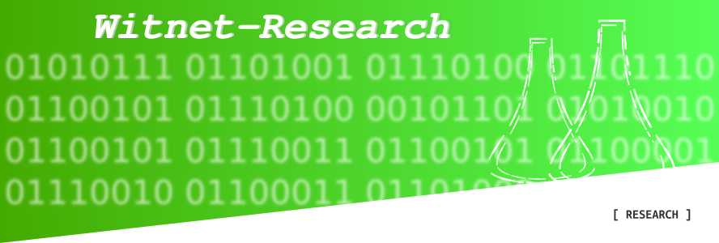

    <h1></h1>
    
    
    
    
      
    
Witnet <strong>research</strong> is an open source repository to allocate research items and academic publications produced by the Witnet Foundation team.

## Design goals

As any other blockchain, Witnet protocol aims to guarantee the common properties such as safety, liveness and fault tolerance. Yet, we would like to focus on the design goals that make Witnet different from other solutions.

### Fairness

We envision this project as a protocol for everybody, thus, one of the main characteristics the protocol will need to achieve is fairness. We have seen many examples of decentralized protocols in which competition between peers is somehow unfair in terms of hardware capabilities or initial stake. Aiming at balancing the data request serving opportunities of all nodes (either newcomers or highly reputed), we have designed Witnet with two sharp ideas in mind:

- **Low barriers to entry for new nodes**. This means that new nodes do not need to stake a significant monetary amount nor invest in expensive hardware to become eligible to resolve data requests or mining. Nodes will compete with each other with respect to their reputation, which can be easily gained by behaving honestly (not tampering with the data).
- **Anti-hoarding**. Spurious incentives may appear if Witnet allowed a perpetuation in the power of the most reputed nodes. These could be bribed to lie in specific data requests for which they could prove valid eligibility. Further, and very related to our previous point, we would like **Witnet to allow anyone to potentially become a reputed node**.

### Data Integrity

As a decentralized oracle solution, Witnet’s main goal is to provide smart contracts with unaltered data from the data sources that witnesses are requested to query. Note that the former is very different from providing the truth: Witnet is not designed to guarantee that the provided answer to a question is a true fact (e.g. the temperature in Madrid is 25 degrees), but rather to guarantee that the provided information is representative (after applying aggregation, filtering and consensus functions defined in the request) of the response the queried sources gave to the query (e.g., according to weather.com the temperature in Madrid is 25 degrees). In order to minimize the potential differences between “the truth” and the provided data point, the data retrieval has the following characteristics:

- **Agreed upon consensus**, i.e., the final result of a data request is not given by an individual node but is the result of a consensus achieved by several data retrievals made by a randomly selected group of nodes.

- **Multi-source fact checking**, i.e., the protocol offers the possibility to consult many data sources and aggregate their responses before reaching a consensus.

- **Economically incentivized**, since honest nodes are rewarded while dishonest ones are penalized.

- **Deters conflicts of interest**, provided by clear segregation of duties among all the actors involved in data request life cycles.

### Fully parameterizable

Last but not least, we envision a decentralized oracle solution that should be as parameterizable as possible. The main goal is to make the platform is flexible enough to enable as many use cases as possible, which may require different types of setups, incentives and trade-offs.

Some examples about this parameterization are:

- **Tailored data requests retrieval and aggregation**: clients define programatically how the results of one or multiple sources are retrieved, aggregated and verified.

- **Tailored data request consensus**: additionally, clients also include the tally clauses in order to programmatically define how to turn the multiple data request results provided by witnesses into a single data point.

- **Parameterizable incentives**: honest resolution of data requests is incentivized by using several mechanisms which can be configured and fine tuned to achieve a specific degree of certainty and security.

Some examples for these customizable incentives are:

- **Data request reward**, incentivize the honest behavior of the nodes resolving the data request (a.k.a. the witnesses)
- **Number of witnesses**, i.e. how many nodes we want the data request to be executed by
- **Network fees**, incentives to the network to include the transactions that are required for the data request lifecycle into subsequent blocks
- **Collateral and coin age**, guarantee the neutrality and honesty of data request committees (prevents sybil attacks)

Ironically, even if all of these customizable incentive mechanisms contribute to make Witnet an exceptionally robust design , **one of the main virtues of this system lays indeed in what is not parameterizable: the committee selection**. In Witnet, committee members (the nodes in charge of resolving a specific data request) are selected unpredictably through Verifiable Random Functions (VRF) weighted by the participants’ reputation scores. That is, the more reputed your node is, the more committees it will end up sitting on.

## Research items

Witnet __research__ includes many different research items and publications intended to contribute to several components of the Witnet ecosystem:

- [Reputation][reputation]
- [Bridge][bridge]
- [P2P][p2p]
- [Bribery][bribery]

## Licenses

Witnet research documentation is published under the [GNU Free Documentation License v1.3][license].

Witnet research software is published under the [GNU General Public License v3.0][license-gpl].

[license]: https://github.com/witnet/research/blob/master/LICENSE
[license-gpl]: https://github.com/witnet/research/blob/master/LICENSE-GPL
[reputation]: https://github.com/witnet/research/blob/master/reputation/index.md
[bridge]: https://github.com/witnet/research/blob/master/bridge/index.md
[p2p]: https://github.com/witnet/research/blob/master/p2p/p2p.md
[bribery]: https://github.com/witnet/research/blob/master/bribery/bribery.md
