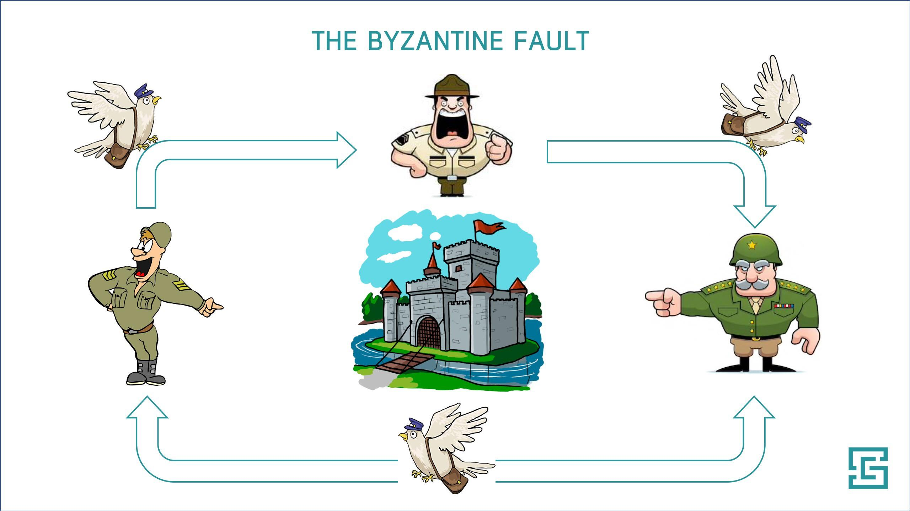
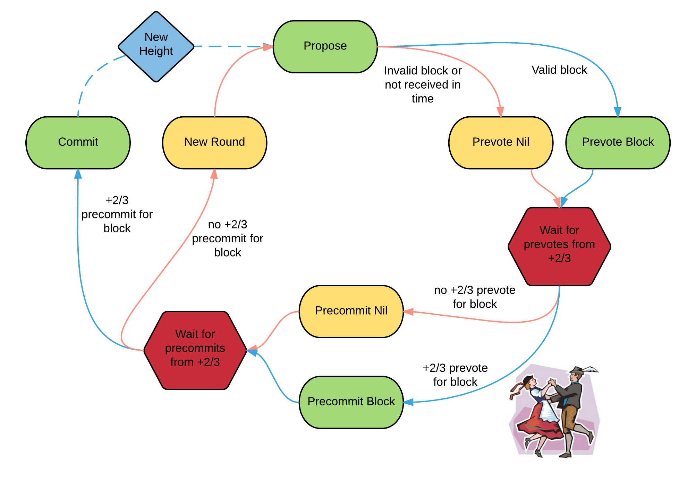
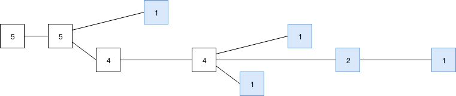
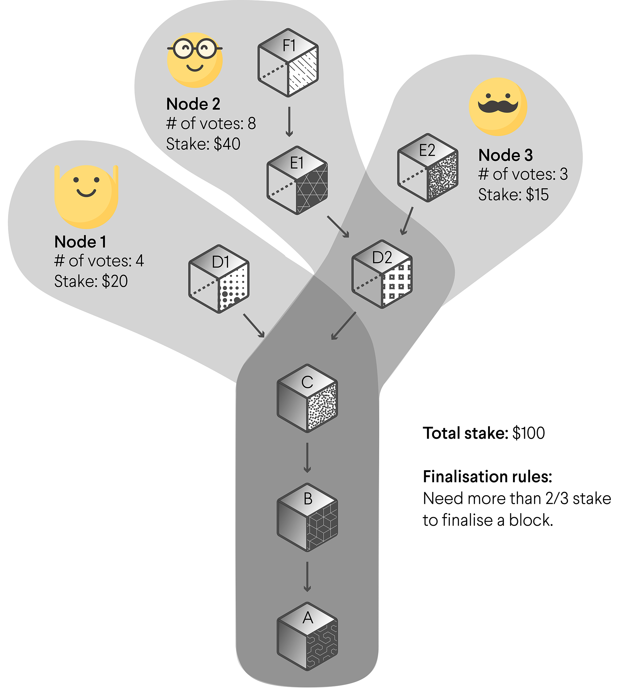

# Byzantine Fault Tolerance Finality

The main purpose of this document is to describe the problems that may have a BFT algorithm and the solutions existing in some the most popular PoS chains. In particular we describe the Finality solution presented by Cosmos, Eth 2.0 and Polkadot.

## Byzantine Generals Problem

The Byzantine Generals Problem can be stated as follows. Imagine you are an army distributed at different positions to attack the enemy base. Imagine that the attack only works if x number of the generals of the different distributions in the army agree on the same decision, either attack or retreat. However, you can not communicate your decision in the distance, i.e., the only way to communicate the decision is to send a messenger, but:

- This messenger could be intercepted by the enemy and never reach the other generals, or worse, the enemy can decide to fake the message.
- One of the generals could be a traitor and therefore send a fake message.

How do we agree into a consensus with these factors? The latter problem is solved by the so called Byzantine Fault Tolerance algorithms that describe that, as long as no more than a fraction _f_ of the soldiers are dishonest, then the honest generals will eventually reach the same consensus. This sentence might just sound vague, but the truth is it implies two very important conditions in BFT algorithms: safety and liveness.

<em>Fig. 1: Byzantine General Problem</em>

Applied to blockchains, message are just the state of the ledger that nodes (generals) need to agree upon. That's why BFT algorithms are so important in our case.

### Byzantine Fault Tolerance algorithms

As said before, there are two very important conditions any Byzantine Fault Tolerant algorithm needs to satisfy. These are:

- __Safety__: If one honest participant agrees on a block, then all the other honest participants need to agree on the same block. That is, honest participants cannot agree on conflicting blocks.
- __Liveness__: Honest participants of the protocol will eventually agree on something. Applied to the blockchain ecosystem, it means the chain will continue growing and that eventually blocks will be finalized.

In partially synchronous or asynchronous network the number up to which faults can be tolerated is 1/3. The reason is:

Imagine we have _n_ nodes, from which  _f_ are malicious and _h_ are honests. Obviously _n_ _=_ _f+h_.
In order to break safety in an asynchronous system the _f_ number of faulty nodes can divide the honest peers in two sets and try to convince each of them to agree on a different thing. This means that, if the threshold to achieve a consensus is _t_, _t > h/2+f_.

Now if we want to ensure liveness that means the threshold should lower than that of the number of honest peers. That is, _t < h_.

The threshold between the two, safety and liveness, is given by

<i>h > t > h/2 +f</i>

<i>h/2 > f, h > 2f</i>

That means, a BFT protocol maximizes both conditions at 1/3 number of fault nodes.

The above means that most of the BFT algorithms guarantee their right functionality for as long as at least 2/3 of the participants have an honest behaviour. Having this in mind, each algorithm has to evaluate how to provide, keeping the validity of the algorithm, the next:

- **Validators rotation**: the validator set must be dyanamic but always keeping 2/3 of honests.
- **Avaiability**: capability of reaction when (in the worst case scenario) 1/3 of the validator set goes offline.
- **Finality**: ability of reaching for all blocks consensus, guaranteeing chain's continuity.

In the coming section we will focus on the Finality gadgets that have been implemented in Cosmos, Ethe 2.0 and Polkadot.

## Finality gadget

The most popular PoS chains, like Cosmos, Eth 2.0 or Polkadot have BFT algorithm that we will review in this section. By default we assume that any blockchain is either partially synchronous or asynchronous, and as such, we will assume each chain can tolerate up to 1/3 of voting power (either as votes or stake).

#### Cosmos (Tendermint)

Cosmos is a PoS system with 100 validators at Genesis and it's expeted the number become around 300 after 10 years. Tendermint, its underlying consensus protocol, sets the number of faulty nodes to be of 1/3 as any other Byzantine Fault Tolerant protocol. These validators do the following:

- Take turns to propose blocks. At each hight, one validator is selected to propose a block
- If no block is commited, we move to next round (weakly synchronous)
- The voting is divided into two stages: pre-vote and pre-commit
- In order for a block to be commited on chain, 2/3 of the validators have to pre-commit for the same block within the same round
- If the block proposer produced a valid block, validators pre-vote for that block. If the block is invalid or they did not receive it, pre-vote null.
- After the pre-vote phase, validators check whether the block proposed (or null) received more than 2/3. If so, precommit for that block. Else, pre-commit NULL. 
- If we do not receive 2/3 pre-commits for one block, a new proposer is selected for the same height.
- Basically, the chain does not advance unless 2/3 agree on the same block.

<em>Fig. 2: Flow of the validators</em>

Safety is guaranteed as 2 blocks can not be finalized unless a set of validators does not follow the rules. If they are found to not respect the protocol, their stake is slashed.

Liveness is guaranteed as long as more than 1/3 of the validators don't go offline. If such thing happens, then the chain halts. Compared to other approaches Tendermint priorizes safety (any block appended is considered final) over liveness. 

Tendermints approach is likely not to be very suitable for Witnet without heavy protocol modification and a good overhead of messages. In the end we would be forcing ARS (Active Reputation Set) members to participate on a multi-round voting that would produce a big amount of overhead. If such an agreement is not reached within the epoch, we would be asking ARS members to vote on a block for which they might not even be part of the ARS anymore.

#### Eth 2.0 Casper FFG

In Ethereum 2.0, Casper the Friendly Finalty Gadget is the mechanism in charge of selecting a unique chain to represent the canonical transactions of the ledger.

In this mechanism a set of validators sign blocks and propose them creating "child" blocks from the previous ones, forming a ever-growing block-tree.

Rather than dealing with the full block tree, Casper only considers the subtree of checkpoints. A checkpoint is set every time the hight of the block tree is a multiple of 100. Notice that this does not mean a checkpoint is set every 100 block, since at the same hight in the block tree more than one block could coexist.
During each checkpoint, the validators send a vote message. The state of the checkpoint is finalized when 2/3 of validators achieve consensus.

To join as a new validator a deposit is needed and  a *deposit message* is sent. The validator joins the validator set two checkpoints after the deposit is sent. In a similar way a validator leaves. Therefore a dynamic validator set is established.
However, when leaving the validator set, there is a "withdrawal delay", before the deposit is withdrawan. If durind this period, the validator violates any commandment, the deposit is slashed.

The penalties in this process are executed when a node does satisfies a **slashing condition**. These are:

- Condition 1: a validator must not publish two distinct votes for the same target height;

- Condition 2: a validator must not vote within the span of its other votes.

<em>Fig. 3: Final blocks during checkpoints</em>

In the figure above stripes represent the checkpoints and _b1_, _b2_, _b3_ are the results after the consensus is achieved in each cheackpoint. The pink chain would be then the canonical chain.

#### LMD Ghost

Casper CBC proposes a Fork-choice-rule named LMD Ghost (latest message driven GHOST). The idea is that when a validator votes over a fork subtree, the last blocks signed by validators are taken into consideration, and the most weighted block is set as valid.

To simplify, suppose there are 5 validators _A, B, C, D, E_, and each of them votes one per slot. Suppose after 9 slots we get the following tree:

<em>Fig. 4: Last blocks signed by validators</em>

where blue blocks are the latest blocks signed by each validator.
To apply the "greedy heaviest observed subtree" (GHOST) fork choice rule a validator starts at the genesis block, then each time there is a fork chooses the side where more of the latest messages support that block's subtree, and keep doing this until reaching a block with no children.

<em>Fig. 5: Blocks with no children</em>

The result is the longest chain, in a well-running network, almost all of the time LMD GHOST and the longest chain rule will give the exact same answer. But in more extreme circumstances, this is not always true.

#### Polkadot (GRANDPA)

In this section we review the finality gadget in Polkadot. The consensus algorithm that describes it is called GRANDPA (GHOST-based Recursive Ancestor Deriving Prefix Agreement), and it is very similar to LMD-GHOST used in Eth2.0.

LMD-GHOST basically counts the last message signed by each validator in a chain, and calculates the score of each chain in the case of fork. The idea in GRANDPA is to find a common ancestor which obtains a super-majority, meaning that more than 2/3 of the validators constructed on it. The ancestor having a super-majority is said to be final or to achieve economic finality.

Unlinke Eth2.0, a block is considered to achieve super finality if it is an ancestor of descendant blocks backed by a super majority. In Eth2.0, LMD-GHOST is used as fork-choice rule, but finality is only achieved if a block is singed by 2/3 of the validator set.

A slashable behavior is that in which a validator signs a block where block B is an ancestor at a round superior at which B became finalized.

In reality these are not votes but weighted votes depending on the validator stake.

<em>Fig. 6: Blocks been added to the canonical chain with GRANDPA </em>

In the figure above blocks A, B and C are backed by the all nodes and thus become finalized. D2 is backed by just 55% of the stake, and such does not become finalized, neither D1 as its only backed by 20%.

Voting happens offchain and does not get appended to any block. However, nodes have proof and are incentivized to show bad behavior since they obtain a reward for it.

## BFT Finality in Witnet

The topic of the finality gadget, i.e., when a block is considered final, is extreamly importat in the Witnet's Block Relay.
With respect to the above solutions, GRANDPA looks like a good candidate for Witnet. In most cases, the header would be finalized in the next set of epochs. But in the case of a fork, since the ARS (Active Reputation Set) might change, the chain would keep growing until those ARS members that got out and did not reach a consensus yet come back to the ARS again and vote for some descendant of the block to be validated. This is not the case of Casper FFG, as the same ARS would be asked to vote in each epoch until they find a 2/3 that second the preceeding blocks.
The details about the Block Relay and how it works can be found [here][Block Relay].

## References

[1]  [Block Relay](./block_relay.md)

[2] [Consensus Compare: Casper vs. Tendermint](https://blog.cosmos.network/consensus-compare-casper-vs-tendermint-6df154ad56ae) 

[3] [Casper the Friendly Finality Gadget](https://www.researchgate.net/publication/320626951_Casper_the_Friendly_Finality_Gadget) 

[4] [A CBC Casper Tutorial](https://vitalik.ca/general/2018/12/05/cbc_casper.html) 

[5] [Byzantine Finality Gadgets](https://github.com/w3f/consensus/blob/master/pdf/grandpa.pdf) 

[Block Relay]: ./block_relay.md
