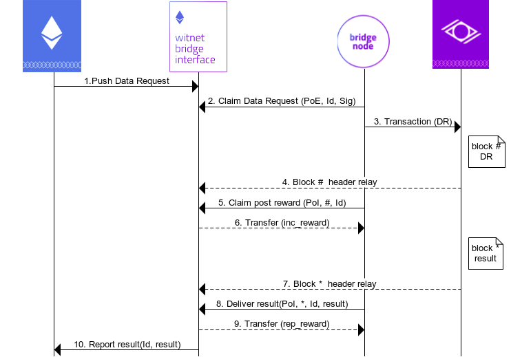

# WITNET BRIDGE INTERFACE

Witnet is a Decentralized Oracle Network aiming at serving smart contracts that cannot fetch data from the outside world. For such goal to be accomplished, the Witnet network and smart contract platforms need to have a way to interact with each other in a trustless way. The Witnet Bridge Interface (WBI) is a smart contract in charge of facilitating this communication.

## Goals of the WBI
The WBI will have 3 clear goals that needs to accomplish:

- It should facilitate the inclusion of a data request transactions specified by smart contracts in the Witnet blockchain.

- It should report back the result obtained by the Witnesses in the Witnet network.

- It should guarantee the validity and trustlessness of the process.

Obviously a smart contract is not able to perform the aforementioned tasks by itself. __Bridge nodes__ are in charge of transporting data from Smart Contract platforms and Witnet.

## Bridge Nodes
We introduce the notion of __bridge nodes__, whose goal is to monitor the WBI looking for data request candidates to be introduced in Witnet and to deliver the result derived by the witnesses. Their role can be clearly observed in Figure 1.

<em>Fig. 1: Bridge nodes read data requests from the WBI and include them in Witnet. At the same time, they read results in Witnet and report them back to the WBI</em>

The functionality provided by the bridge nodes can be clearly defined in three main points:

- Data request reading from WBI and inclusion in Witnet
- Result reading from Witnet and reporting to the WBI
- Block header relay

The latter point allows us to complete the first two points in a trustless manner. However, we do not discuss how block header relaying will be achieved in this document, but we rather assume the WBI contains all Witnet block headers.

However, nodes need to become eligible to perform any of the aforementioned tasks. The way the are selected is with a Verifiable Random Function (VRF), much alike they way witnesses are selected to perform a data request (see the [witnet whitepaper](https://witnet.io/static/witnet-whitepaper.pdf)). 

## Capabilities of the WBI
The WBI needs to guarantee that data requests are included and that results are delivered in a trustless manner. Under the assumption that Witnet block headers are already known to the WBI, the WBI can guarantee this with the following capabilities:

- __Data request storage__: The WBI stores pushed data requests until the time to publish them arises. At that point, the bridge node reads and introduces the data request in Witnet.

- __Result reporting__: If a bridge node reports back the result of a data request, the WBI should forward it to the appropriate smart contract.

- __Forwarding incentives__: Bridge nodes have incentives to perform any of the previous two actions. Upon data request inclusion or result reporting, the WBI should unlock their reward.

- __Proof of Inclusion Verification__: The WBI can not reward the bridge nodes unless they provide a proof of inclusion of the aforementioned transactions in the Witnet blockchain.

- __Proof of Eligibility Verification__: The WBI should be able to determine whether the bridge node was eligible to perform a particular task for the current epoch.

__Proof of Inclusion Verification__:

Similar to the way Simple Payment Verification works in Bitcoin, the WBI can verify whether a transaction was included in a Witnet block if the block header is known. Since the merkle root of the transactions is stored in every Witnet block header, the bridge node only has to report the merkle path that leads to the associated merkle root.

However, we can improve the efficency and cost of the verification if we design our merkle tree slidely different. It should not be a surprise that data request and tally (where the result is derived) transactions are expected to appear in a smaller number with respect to commit and reveal transactions. This is because we have only one data request and tally transaction per data request, but *R* commit and reveal transactions (*R* is the replication facor).

Thus, we can unbalance the merkle tree to compute merkle paths for data request/tally transactions from one side and commit/reveal transactions from the other side. It is expected that the number of hashes to compute for verification is substantially smaller, in particular *log(n) +1* being *n* the number of data requests/tallys in the block.

<em>Fig. 2: Unbalanced merkle tree whose DR verification becomes more efficient.</em>

In Figure 2 we present an example of such a scheme. The verification of the inclusion of any of the DRs (green) takes only 2 hash operations (we need H8 and the other DR). However, the verification of a commitment transaction (yellow) requires 4 hash operations, thus incurring in additional costs in the smart contract.

A further improvement can be to reorder hashes in each level, so that we do not need to pass the indices as an argument to know where the WBI to append the hashes. The WBI would know where the hash needs to be appended just by checking which of the hashes at each level is bigger.

## WBI Cycle

In the following we describe the interactions that the WBI and bridge nodes need to make in order to trustlessly demonstrate that a data request has successfully completed in Witnet. We use Figure 3 as a bakcup to describe the steps. Without loss of generality, assume the WBI connects Ethereum and Witnet. Note that, although in Figure 3 the same bridge node includes the data request and delivers its result, in practice these two actions can be made by different bridge nodes. Also note that the block relay is depicted, although not specified how it will be performed. 

<em>Fig. 3: Action sequence for the insertion and resolution of a data request from Ethereum to Witnet.</em>

__Data Request Inclusion__:

- 1. A smart contract pushes a data request into the WBI specifying the rewards that both its inclusion and its result reporting will generate for the bridge node.

- 2. A bridge node realizes its leadership position and reads all the unassigned requests that have been posted to the WBI contract. For this purpose, it reports both a Proof of Eligibility and a signed addres to which the reward will be assigned. It is important that both the eligibility and signature are produced with the same private key. The WBI verifies the Proof of Eligibility and the signature and if valid, locks the eth for a certain amount of time. This will be rewarded to the bridge node upon PoI verification. If a valid PoI is not presented on time, the ETH will be locked for the next bridge willing to include it.

- 3. The bridge node “cross-posts” the data request into the Witnet blockchain.

- 4. Upon successful inclusion of the data request transaction in the blockchain, the block header is relayed to the WBI.

- 5. The bridge node makes a call to the WBI contract including the Proof of Inclusion. The WBI contract internally verifies the  proof.

- 6. If the proof was valid, the WBI sends the ether reward to the bridge node. Note this reward needs also to pay for the cost of introducing the DR in Witnet.

__Result Delivery__:

- 7. The data request is resolved in Witnet and its result is stored in block *, whose header is relayed to the WBI.

- 8. A (possibly different) bridge node realizes the result is ready to be sent back to the WBI, and posts it with the Proof of Inclusion. The contract internally verifies the proof.

- 9. Upon succesful verification, the WBI sends the result reporting reward to the contract caller.
   - 9.1. Alternatively the result will be available in the contrat to be requested by the contract caller.

- 10. The result is either reported back or read from the requesting Smart Contract.

## WBI Library Requisites

As we have exaplined in previous versions, there are two main cryptographic functionalities that the WBI will need to do: PoI and PoE verification. The first requires SPV-like libraries, while the latter requires EC arithmetic to be performed in solidity. We have researched implementations of both requisites in solidity. 

The libraries we found for ECC arithmetic are the following:

- https://github.com/androlo/standard-contracts/blob/master/contracts/src/crypto/Secp256k1.sol: works with Jacobians sometimes and sometimes with affine points. Pretty complete,but we would need to expose the addition and multiplication functions. 

- https://github.com/orbs-network/elliptic-curve-solidity: Curve operations for alt-bn 128, although the author claims they can be exported to any curve.

- https://github.com/jbaylina/ecsol:. Secp256k1 curve operations. We would need to expose the addition function too. It also provides affinity friendly function exposure.

The libraries we found for SPV are the following:

- https://github.com/ethereum/btcrelay : Implemented in serpent.

- https://github.com/crossclaim/btcrelay-sol: Implementation of SPV BTC relay in 
solidity. Includes merkle proof verification.

- https://github.com/ethers/bitcoin-proof: Although inactive for long time, it provides merkle proof for a bitcoin transaction.

- https://github.com/summa-tx/bitcoin-spv: SPV implementation in solidity, provides merkle proof and python scripts for generating proofs and blocks.

## WBI API

The WBI API can be checked in https://github.com/witnet/witnet-ethereum-bridge

