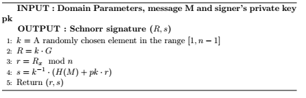
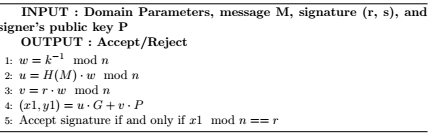
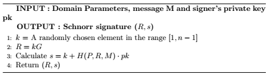
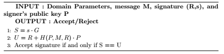
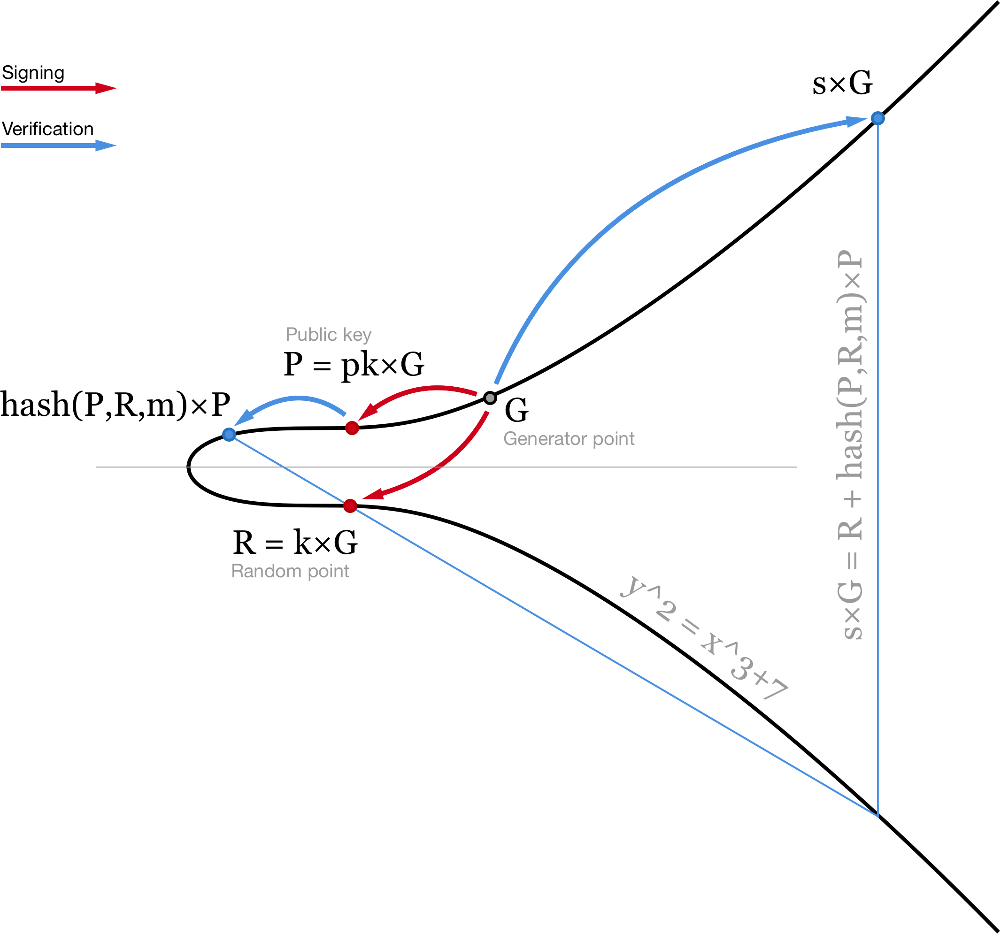
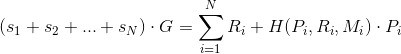
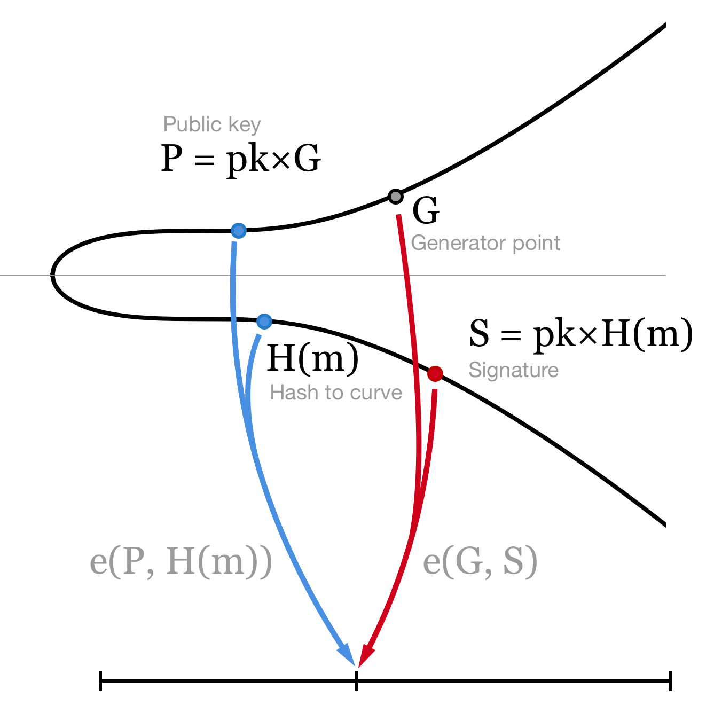
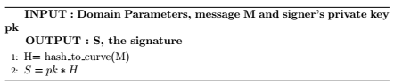
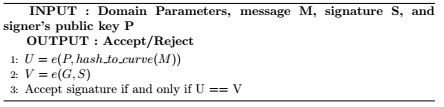

# Signature Aggregation Posibilities

One of the main drawbacks of interacting with a platform like Ethereum is the associated gas cost to complex operations. Specifically, operations that involve elliptic curve point multiplications and modular inversions, even if they are subsidized, imply significant gas costs when several signatures need to be verified. In the case of the Block Relay, where several signatures signed by ARS members need to be verified, it becomes necessary to find alternative solutions than just iterating over the ecrecover function.

## ECDSA: The Problem

ECDSA signature verification is subsidized in Ethereum through the ecrecover function. The main problem arises when several of those verifications need to be performed. The ECDSA signature generation is presented below:

<em>Fig. 1: Signature generation in ECDSA</em>

First, one of the drawbacks that we observe is that a random number $k$ is needed. This, in order to avoid trusting a RNG, is usually given by the RFC-6979 standard. The ECDSA signature verification algorithm is presented below:

<em>Fig. 2: Signature verification in ECDSA</em>

As we can see every ECDSA signature involves a couple of point multiplications and one inversion, all costly operations. This, as the number of signatures to be verified increases, the associated gas cost becomes unacceptable by a protocol like Witnet. Further, the input if we want to verify a transaction signed n peers is n signatures.

## Schnorr signatures

Schnorr signatures main difference with respect to ECDSA are mainly that the output consists of a point in the curve R and a scalar s, instead of two scalars. The signature generation can be observed in the algorithm below:

<em>Fig. 3: Signature generation in Schnorr</em>

While the verification can be observed in:

<em>Fig. 4: Signature verification in Schnorr</em>

Obviously, the verifier does not know anything from the signers secret key, as he is only given R from which he cannot derive k. From the other side, when multiplying *s * G = (k + H(P, R, M) * pk) * G = k * G + H(P, M, R) * pk * G = R + H(P, M, R) * P*

<em>Fig. 5: Schnorr signatures from https://medium.com/cryptoadvance/bls-signatures-better-than-schnorr-5a7fe30ea716</em>

Now when we need to verify several signatures (as it would be the case in Witnet if we want to verify that the ARS signed a block header), with ECDSA we would need to verify one by one the signatures. More than that, theoretically for N signatures we need to compute 2N multiplications and N inversions.

For Schnorr signatures we have a very nice addition property. Indeed note that:

<em>Eq. 1: Aggregate signatures</em>

In this case we need to perform some point additions (whose cost is negligible with respect to multiplication) and N+1 multiplications. That is a very good speed up with respect to ECDSA.

But the good point of these is that we can aggregate signatures, by computing *s= (s1, s2, ..., sN)*, *R= R1, ..., RN* and *P = P1, P2, ..., PN*, this time the signature has to be computed as:

*si = ki + H(P, R, M) * pki*

Now in order to verify the signature:

*s * G = R + H(P, R, M) * P = (s1 + s2... sN) = (R1 + R2+ ..+RN) + H(P, R, M) * (P1+P2+...+PN)*

The main problem with this kind of construction is that we need to agree first on the participants and then calculate common P, R and S.

Also we have the Rogue key attack. In this case, if we have two participants A and B and an aggregate public key *P = PA + PB*, Bob can send a false key *P_Bf =  PB - PA*. If this is the case, then the aggregated key now becomes Bob public key, meaning Bob can be claiming to be signing for both A and B while in practice he is only signing with his private key.

Further, we did not mitigate the problem of requiring the random number generator in place.

## Boneh–Lynn–Shacham (BLS) signatures

BLS signatures fix some of the issues that we observed with Schnorr signatures, as they do not rely on random number generators and we do not need several communication rounds (or to know the set of participants beforehand). However, there are some concepts we need to introduce, specially curve pairing:

Imagine we have a funtion $e$ that has the following properties:

- *e(P, Q) -> n*
- *e(x * P, Q) = e(P, x * cdot Q)*
- *e(P, Q + R) = e(P, Q) * e(P, R)*
- *e(a * P, b * Q) =  e(P, a * b * Q) = e(a * b * P, Q) = e(P,Q)(ab)*

<em>Fig. 6: BLS signatures from https://medium.com/cryptoadvance/bls-signatures-better-than-schnorr-5a7fe30ea716</em>

Let's further assume that these functions dont reveal anything about the input scalars. We call this function $e$ the pairing function. For using such functions we need curves that are pairing-friendly.

Further, let's assume there exists a Hash_to_Curve function, i.e., a function that takes the hash of a message and maps it to a point in the elliptic curve. Such a function is the identical to the one used in VRF.

The signature is just calculate as the first three steps in the VRF proof generation. In fact, the generation is given by:

<em>Fig. 7: Signature generation in BLS</em>

And the verification

<em>Fig. 8: Signature verification in BLS</em>

Basically based on the properties formerly defined:

*e(P, Hash\_to\_curve(M)) = e(pk * G, Hash\_to\_curve(M)) = e(G, pk * H(M)) = e(G,S)*

The properties that these kind of signatures have are very attractive. For instance, note that we can aggregate any set of signatures we want:

*S=S1 + S2 +...+SN*

*e(G, S) = e(G, S1+S2....+S100) = e(G, S1) * e(G, S2)... * e(G, SN) = e(G, p1 * Hash\_to\_curve(M1)) * e(G, p2 * Hash\_to\_curve(M2))... * e(G, pN * Hash\_to\_curve(MN)) = e(P1, Hash\_to\_curve(M1)) .... * e(PN, Hash\_to\_curve(MN))*

This implies that we need to calculate 1001 pairing functions in order to verify. Close to the number of costly functions that we need to perform for Schnorr, but pairings are much more costly than multiplications.

However, if all signers are signing the same message:

*e(G, P1 * Hash\_to\_curve(M)) .... * e(G, PN * Hash\_to\_curve(M)) = e (G, (P1+P2..+PN) * Hash\_to\_curve(M) = e(G * (P1+P2..+PN), Hash\_to\_curve(M))*

There are a few downsides from using BLS signatures:

- The pairing functions have not widely been studied nor attacked, and therefore their security is still to be proven. As of today, we do not know of any attack that can break them.
- The efficiency of pairing functions with respect to ECDSA signatures is rather low. However, for certain cases (like that in which we can aggregate signatures of the same message) we can make use of their properties to achieve a higher efficiency than with regular signatures.

