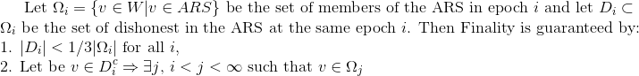
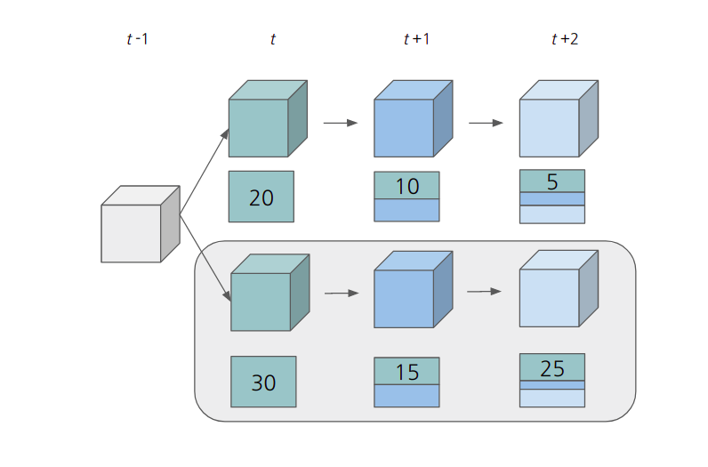
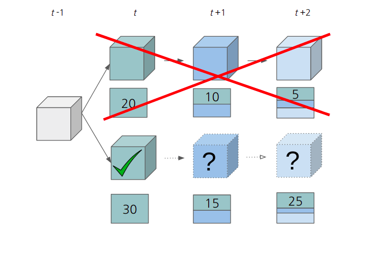
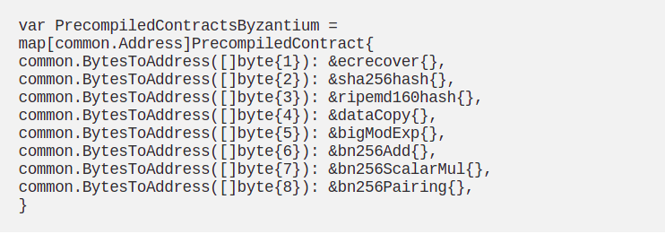
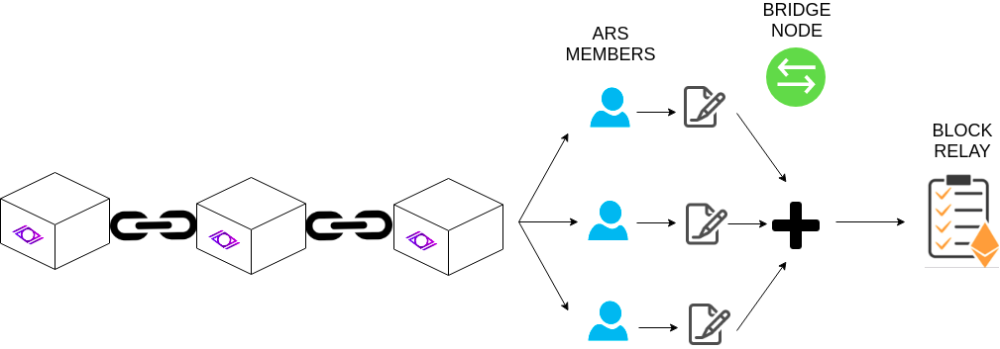
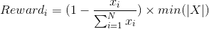

# Block Relay in Witnet

The Witnet Requests Board (WRB) is a core component of the Witnet protocol as it enables the communication between the smart contracts in Ethereum and Witnet. In order to trustlessly verify transactions included in a Witnet block, the Ethereum smart contract needs to be able to perform verifications of the so called Proofs of Inclusion (PoI). Assuming all Witnet block headers are available to the WRB, a bridge node simply needs to provide the merkle path that includes the transaction to be verified and that reaches the root in the block header.

Obviously the aforementioned mechanism works just because we assumed the block header is available in the WRB. How to make this possible with a non PoW/PoS chain is a more challenging concern though. Without loss of generality, we will assume that the WRB has access to the Witnet block headers because they are stored in another contract in Ethereum that is called the **Block Relay**. Essentially, the goal is similar to that of building a Witnet **light client in Ethereum**. As any light client, the block relay contains the headers but performs little to no validations. We will focus thus on how these blocks are reported to the block relay.

As with the WRB, only bridge nodes have access to both Witnet and Ethereum chains. Thus, bridge nodes should be in charge of reporting valid blocks that will later be used to verify PoIs in the WRB. We observe three main challenges:

- **Integrity of the Block header**: the reporting protocol needs to guarantee the integrity and validity of the block header reported. From the block relay perspective, this essentially means that a block header does have enough acceptance as declared by a majority of Witnet reputation holders.
- **Economic incentives**: the reporters should be economically incentivized to post correct block headers in the Block Relay contract.
- **Handle chain forks and finality gadget**: the Block Relay should be able to recover from chain forks in which the tip of the chain diverges.

## Block Header Integrity: the problem

Recall Witnet does not feature a PoW nor PoS consensus mechanisms, but rather it utilizes cryptographic sortition with biased probabilities depending on past behavior. The trustlessness property is thus more difficult to achieve as we cannot simply look at the chain with the longest amount of work/stake. Note that there are implications of a malicious header being inserted in the block relay severe, as:

1. She can preconstruct a header including a result of a data request of her interest that was previously posted to the WRB. She can even make up a beneficial Active Reputation Set (ARS) and report it with the header. She reports the block header to the Block Relay contract, which accepts it by majority.
2. She later constructs a PoI for the header she inserted in the block relay, aiming at verifying the result of her interest.
3. The WRB accepts it and stores it as the result to the data request, while the true result remains unreported.

 Simplifying, we need a groups of nodes to agree on the particular block header in a non-synchronous network. This traditionally has been resolved by **Bizantyne Fault Tolerance (BFT)** algorithms, that ensure that if there are no more than *f* number of attackers, the network is going to achieve liveness and safety properties. 
## Proposed Solution

In the end our main problem resides on the fact that we need a set of nodes to agree on a state. We solve this problem, as the majority of the PoS systems, by utilizing a BFT algorithm. A review on the Byzantine Generals Problem and some of the BFT approaches, specially with respect to finality in PoS systems, can be found [here][BFT].

### Voting Committee
As with any other BFT approach, the first thing we need to do is define the committee that will reach an agreement. In PoS systems this committee is often referred as the **validator set**. It is clear that only Witnet nodes know the state of the chain, so here are our options:

- __Bridge nodes__: The main issue when we set the bridge nodes as our committee is that these are easily sybileable. The number of bridge nodes is expected to be substantially lower than the number of nodes in Witnet. Thus, a malicious attacker can just spin up the necessary nodes to take over the entire bridge node set and insert a fake header aiming at reporting a fake result.
- __Witnet known Identities__: Instead, we could let every identity that participated in Witnet vote for the correct chain tip. We foresee some issues with this approach. First, the safety and liveness characteristics are guaranteed as long as 2/3 of the reputation points reside on honest participants, which is a reasonable assumption. However, note that the number of signature messages that need to be exchanged and the number of signatures to be verified in the block relay increase substantially. Additionally, the block relay should retain every single header to check voters participations, without having the possibility of discarding sufficiently old headers.
- __Active Reputation Set__: The third approach is to let the Active Reputation Set (ARS) define the current chain tip. The ARS defines the most recent (N epochs) participants in Witnet. Clearly this is the most difficult to be corrupted by an attacker. First, as with the previous approach, we can assume that 2/3 of the reputation will reside in hands of honest nodes, and it is likely that the ARS will contain nodes with high reputation, thus having an interest on being honest. But further, we implemented collateralization and coin-age countermeasures that harden the possibility (and increase the cost) of colliding 1/3 of malicious actors in the ARS. Thus, it is expected that the integrity of the ARS is guaranteed and therefore the ARS members should be in charge of reporting the chain tip. This ARS is limited with respect to the velocity of the Witnet network, thus making even more difficult and costly to sybil it. 

In order to secure the block relay we should thus trust the committee that is more costly to sybilize, in our case the ARS. Thus, the block header at epoch i-1 defines the committee at epoch i. However, we still need to prove to the block relay that a certain ARS identity voted for some chain tip B. In order to do so, we define __Proof of Membership__.

### Proof of Membership

In this section we formally define Proof of Membership, i.e., the ability of a Witnet node to demonstrate it was part of the ARS at a specific point in time. In order to provide this capability, we need the inclusion of the merkle root of the Active Reputation Set (ARS). The leaves are the public keys of those members in the ARS. Remember that the ARS is defined as the participants that have been actively working for the Witnet network, in the form of witnessing or mining, in the last N epochs (where N is a protocol parameter). As such, if a Witnet node needs to prove its membership to the ARS at a specific point in time it needs to provide:

- A challenge signed with the private key corresponding to the public key the node claims to be associated with.
- The public key itself;
- The merkle path (siblings) that lead to the ARS merkle root at a specific point in time;
- The point in time at which it is claiming to be part of the ARS;

A proof of membership is composed of σ = (C, Sig( C ), PK, Merklepath, epoch). In practice the challenge can just be the concatenation of the beacon plus the address of the sender.

In order to verify the validity of the proof of membership, the verifier needs to have access to the block header of the epoch at which the prover is claiming to be part of the ARS. If so, the verifier:

1. Verifies that the public key and the siblings lead to the merkle root provided
2. Verifies the signature to check that the prover is indeed in possesion of the corresponding private key.

### Finality in Block Relay
One of the main topics when discussing Bynzatine Fault Tolerance on blockchains is the so called finality gadget, i.e., when can we say a block is final. This topic is extremely important in the block relay, as it defines when transactions reported by bridge nodes can become trusted. A full review of different finality gadgets related to Cosmos, Polkadot and Eth2.0 can be found [here][BFT]. Out of those, the algorithm that suits better for Witnet is Grandpa. The reasons are:
- First, we need to be aware that we might not achieve  immediate finality on a particular block header, and as such, that we need to continue growing the chain until we see that a particular ancestor achieves 2/3 of the votes. 
- Further, we need to realize that in the case of a non-finalized fork the ARS members in descendants blocks might change. Although the ARS is not expected to change substantially, even in that case, the only consequence would be that the block would be finalized once they come back to the ARS in a future epoch.
- With Grandpa, only the ARS members for the current epoch need to sign the last beacon/block. The rest of the nodes in the network do not need to sign the last beacon, as it would be the case in Casper FFG and Cosmos.
- With Casper FFG we would be enforcing the ARS to vote each epoch until 2/3 are reached, in which case all its ancestors are validated. That means that at each epoch every node in the network needs to cast a vote (as they might have been in the ARS in recent epochs), or in the best case, everybody who was in the ARS in the last N epochs.

- With Tendermint, ARS members would be stuck until they reach a 2/3 consensus. This, in addition to reproduce the problem we explained with casper FFG, also halts the network if more than 1/3 goes offline. This is not the case in FFG and GRANDPA, as the chain continues growing until 2/3 are achieved in descendants or ancestors.

GRANPA stands for GHOST-based Recursive Ancestor Deriving Prefix Agreement and the idea is similar to LMD-Ghost in Casper CBC: when having a fork, the last blocks signed by the validators are checked, and the heaviest is considerd the valid one and so the chain in which it is. In GRANDPA a chain signed by sufficient validators consolidates its ancestor.
In particular, suppose there is a fork in the blockchain, the chains continue aggregating blocks (when validators sign those blocks) and by the time one of the chains is signed by 2/3 of the validator set the first block is confirmed.

In Witnet, validators are the  members of the ARS, which, as mentioned before, could change from one epoch to another. Suppose at epoch *t* a block *Bt* is singed by less than the 2/3 of the ARS, then it will be validated when 2/3 of that ARS sign its descendants. Notice that even if the ARS changes, the change is not substancial and the members tend to reappear in the ARS. So as the chain grows at some point at least 2/3 will have vote from epoch *t* and due to safety they will agree on the same chain, validating block *Bt*.  More formally:

<em>Fig. 1: Finality of GRANDPA based on ARS member votes</em>

Proof: Condition 1. is given by BFT, since at most 1/3 are dishonest. Condition 2. on the other hand is given by the construction of the ARS in which nodes are incentivize to stay on-line. Because of this, due to the fact that members of the ARS are the most reputated nodes we can suppose that at least 2/3 of them will have an honest behaviour and so they will be selected as part of the ARS in the next epochs.

Let's see an example of how this would work in Witnet. Suppose we have 100 nodes in the ARS at epoch *t*, from who, 30 sign a block ad 20 another one, as in the next figure:

<em>Fig. 2: Fork in the block relay</em>

As none of the blocks got 2/3 of the ARS none is set as final and both chains continue growing. In epoch *t*+1 the first chain gets another 10 signatures form the ARS of epoch *t*, reaching 30 signatures while the second chain gets 15 new signatures, 45 signatures in total. As in epoch *t*, none of them gets enough support.
However, in epoch *t*+2, the second chain sums another 25 signatures, reaching 70 signatures of the 100 members of the ARS in epoch *t*, and so more than the 2/3 necessary. This way the second block proposed in epoch *t* is considered valid, as one can see in the figure that follows. This mechanism is repeated for the next block, this time taking into consideration the ARS of epoch *t*+1, that may differ from the ARS in the previous epoch.

<em>Fig. 3: The bottom chain signatures validate the block at time t as it achieves 2/3s</em>

### Improving Efficiency through aggregated signatures

The aforementioned approach has a big drawback: it would take 1000 verifications to verify 1000 ARS members signatures. We always pursue a gas-driven design, i.e., a design that decreases the gas cost in Ethereum. Clearly verifying one by one the signatures imposes a prohibitive gas cost. A different proposal might be that the voting is based on aggregated signatures. [This document][Aggregated-sigs] describes different approaches that can be taken to aggregate signatures. In this case, ARS nodes could just send the last header they know about signed, and the bridge node would just need to aggregate those signatures. Among our posibilities we choose BLS signatures for two main reasons. First, our committee size is varying and therefore it becomes substantially difficult to apply Schnorr. Further, BLS signatures will be utilized by Eth2.0 and are subsidized, thus reducing further the cost.

<em>Fig. 4: Pre-compiles in Byzantum</em>

With BLS signatures, it would only take one verification in the block relay contract to verify all the aggregated signatures from the ARS. At this stage, VRFs in the WRB would still be performed with the curve secp256k1, but `LAST_BEACON` messages would be signed with BLS.

<em>Fig. 5: ARS signatures are aggregated so that a single verification is performed in the block relay</em>

### Economic Incentive: fee as low as possible

Another aspect that the block relay needs to cover is the fact that nodes will have an economic incentive to report blocks (any transaction verified in a block reported by them implies a reward), and they should not be able to set the reward as high as to make the data request non-executable. In order to cope with that we propose an inverse auction: the lowest price with respect to the number of signatures provided reported by a bridge node is the one that is set as the fee. However, we still reward all bridge nodes that participated in the correct block header consensus reporting. We apply proportionality as to how deviated the reports were with respect to the minimum. Let's work through an example, in which we assume every bridge node contributed with the same numbre of signatures:

- Imagine both Alice and Bob report the same correct block header to the block relay.
- Alice sets a report reward fee of 1 ETH, while Bob sets the fee as 9 ETH.
- In this case, 1 ETH is established as the block report reward, of which 0.9 will go to Alice and 0.1 to Bob.

With that in mind the reward that each node would obtain for someone whose reported block was successfully utilized in a PoI verification is:

<em>Eq. 1: Reward for each of the block header reporters</em>

where |X| = x1, x2, ..., xN and each xi is the value proposed by selected node i.

With this scheme all nodes are incentivized to set the fees as low as possible in favor of price competition. Ideally, all bridge nodes would set it low enough (taking into account the transaction gas and potential benefit derived from the WRB) so that they get an equal share of the rewards.

## Stages

We divide the process of relaying blocks in different phases to be implemented in the process of building a decentralized efficient block relay. However, each of the phases will share the API to which bridge nodes connect, aiming at offering the most ergonomic updating process to the bridge nodes.

### Stage 1: ARS voting

Stage 1 requires the ARS members to vote for the correct block hash candidate in the block relay. This is, all nodes interested on the healthiness of the system need to run both an Ethereum client and a Witnet node to become witnesses and bridge nodes at the same time. This stage includes the merklelization of the ARS as well as the proof of membership verification.

In this case, the block hash candidate that received more votes from the ARS is the one that is consolidated. As said before, we expect the ARS members to be those that have higher reputation and in consequence to be those more interested in having a good block relay.

### Stage 1.5: Weighted ARS voting

In this stage, the influence on the voting of the block header hash is weighted according to the reputation that ARS members have. However, in order to avoid the situation in which a single identity can heavily influence the voting, we can instead weight votes by the position they hold in the ARS. For instance, one could make sure that the first 25% copes with the remaining 75% of the ARS. This way, in order to influence the voting a potential attacker needs to influence the top 25% or the lower 75% of the ARS. Further, an attacker not only needs to place more than 50% of identities in the ARS but rather she also needs to become either the top reputed entities.

### Stage 2: collateralized voting (?)

Additional to previous stages, the voting scheme may include a collateral in order to increase the incentives of being honest. Those behaving dishonestly (i.e. reporting block headers that end up not being canonical) will lose their collateral, which may be distributed among honest reporters or even be burned.

### Stage 3: BLS signatures

The third phase can be divided in two main purposes. First, the implementation of BLS signatures in Witnet, such that ARS members can vote for the chain tip and witnet bridge nodes can aggregate signatures. Second, the verification implementation in the Block Relay where a single signature verification is enough to verify the aggregated signatures. In this stage, the chain tip is still decided by majority in the block relay, but a single verification is enough to verify the belonging to the ARS.

A pre-assessment about potential impacts in the P2P network will be made, more specifically in the `LAST_BEACON` message exchanges among peers.

### Stage 4: Implement Finality Gadget

In this stage the finality gadget is implemented in the Block Relay, such that a block is considered final only if 2/3 of the current ARS voted for it or their descendants. If not, the block relay stores both chain tips until one of them is decided.

Additionally, the bridge node needs to implement a smart key signing in which all signatures belonging to the ARS of the last non-finalized block or their descendants.

Further, the bridge node needs to be able to insert penalization transactions in Witnet whenever it sees a slashable behavior, such as voting for two chain tips within the same epoch. The slashing will imply a reduction of reputation points of those that double-voted.

### Stage 5: Replace VRF by BLS

[To be completed after assessment]

As aforementioned, stage 3 requires BLS signatures by Witnet nodes. Taking into account that BLS signatures are deterministic, there is a clear opportunity of using BLSs instead of VRFs for computing Proof of Eligibilities (PoEs). This is possible due to the fact that PoEs have fixed inputs for all participating nodes (e.g. data request identifier and beacon).

However, before replacing VRF with BLS, it is required to perform a further analysis about the following topics and concerns:

- Efficiency of BLS compared to VRF, both in Witnet nodes and Ethereum Smart Contracts (EVM).
- Assessment of potential changes in the Witnet, both in the Witnet transaction model (e.g. commit transactions).
- Assess maturity of BLS (e.g. pairing functions) in terms of crypto analysis (e.g. known attacks and vulnerabilities).

### Stage 6: Evaluate a hard-fork/dispute mechanism to recover

Things to do:

- Assess if dispute mechanism if required
- Assess how the Block Relay could recover from a fork

[Aggregated-sigs]: ./aggregated_signatures.md
[BFT]: ./BFT_finality.md
