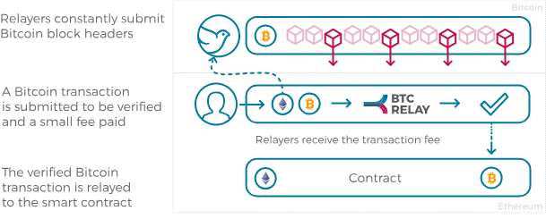
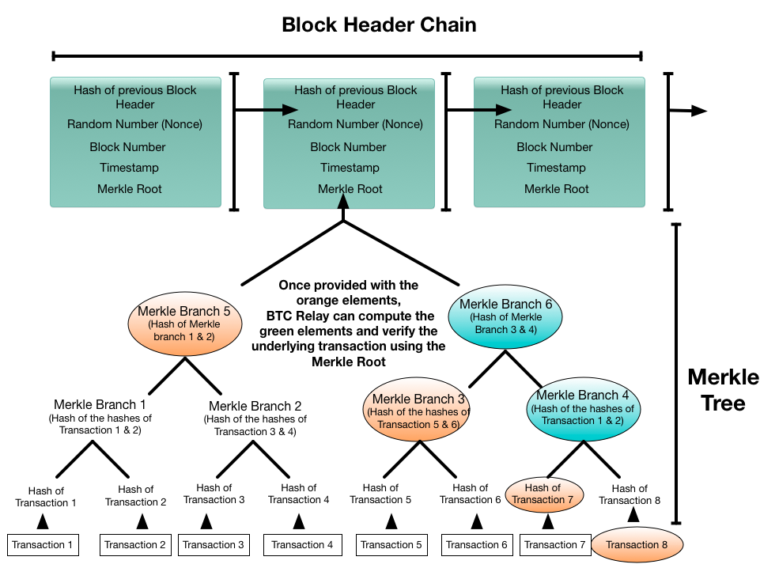
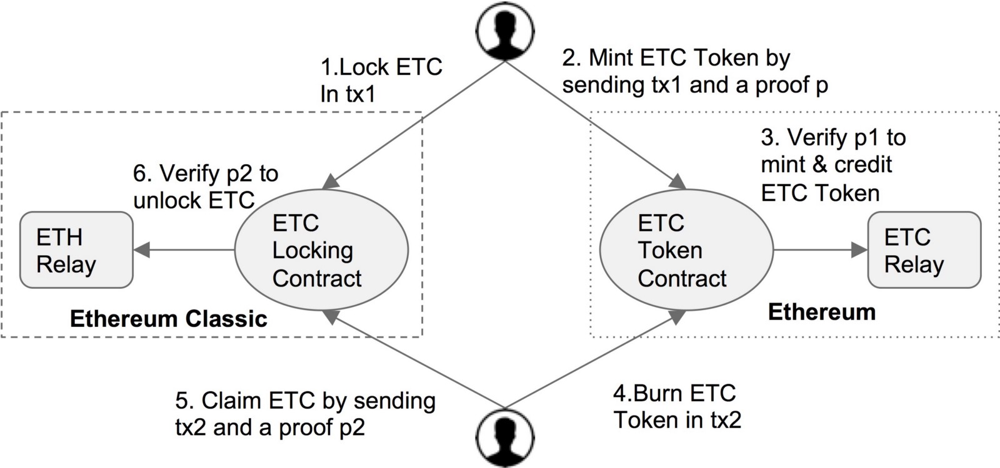
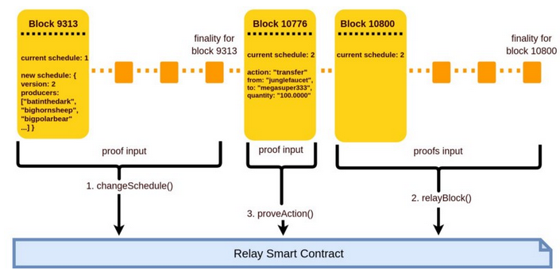

# State of the Art on Bridges

Since Witnet implements its own blockchain, it needs to interact with other networks to serve as an oracle for smart contracts. This is usually refered as *bridging* between two chains. The purpose of this document is to review the state of the art of different bridge implementations. This information will later be used to design and implement the __Witnet Bridge Interface__ (WBI).

## BTC relay

[BTC relay](http://btcrelay.org/) is a ligh-client smart contract on Ethereum used to verify Bitcoin transactions. Some of the main functionalities it provides are:

- Verification of bitcoin transactions
- Bitcoin transaction relaying in Ethereum
- Storage of bitcoin block headers
- Up-to-date provision of Bitcoin tip

BTC relay can be divided in two main features: block header relay and Simple Payment Verification(SVP):

__Block Header Relay__

In order to properly asses the SPV, the BTC relay contract needs to know the block headers from Bitcoin. Nodes that relay the block headers are refered as __relayers__. Intuitively, these relayers should be properly incentivized for including the block headers. In fact, each relayer specifies a fee with which it wants to store the header. This fee is the amount they will obtain if a transaction that was included in the submitted block is verified. This is, __relayers are economically incentivized to submit valid block headers__.

However, the aforementioned system could be abused by a relayer that sets excesive fees. In order to avoid this behavior, __BTC relay allows relayers to specify a lower fee rate__ than the one specified by the first relayer.

<em>Fig. 1: BTC relay accepts Bitcoin headers and rewards relayers if transactions included in the submitted block are verified (picture from <a href="http://btcrelay.org/">BTCrelay</a>)</em>

__Simple Payment Verification (SPV)__

SPV takes advantage of the information already available in the BTC relay contract: the block headers. Recall that every block contains a Merkle Root representing all the transacions included in that block. Given a particular Merkle Root, it is very difficult to derive a different set of transactions (than those that were actually included) that lead to the same Merkle Root.

Having this in mind, it is quite simple to verify in the BTC relay contract that a transaction indeed took place in Bitcoin. This is illustrated in Figure 2:

<em>Fig. 2: In order to verify a transaction, the merkle path to the merkle root needs to be provided</em>

To prove that either transaction 7 has been recorded in the Bitcoin blockchain, all that is required is the Block Number and the elements highlighted in orange. The turquoise branch nodes 6 and 4 are computed in the verification process. Armed with this “Merkle proof”, and the header chain held by BTC Relay, bitcoin transactions can be verified. Any user or smart contract on the Ethereum system can then ask BTC Relay to validate if a specific transaction actually occurred on the Bitcoin network.

## Peace Relay

[Peace Relay](https://github.com/KyberNetwork/peace-relay/) was inspired by BTC relay, but rather than allowing one-way interaction between the Bitcoin and Ethereum chains, it permits the transfer and verification of cross-EVM-chains, e.g., Ethereum and Ethereum Classic. This dual way cross-chain verification is usually refered as __2-way peg__. In reality tokens in one chain are locked until the released tokens on the secondary chain are burnt. As in BTC relay, contracts store the block headers associated with both chains, while relayers get rewarded in the corresponding token if the submitted block headers aid in the verification of a transaction. Merkle path verification works similarly to how SPV works in BTC relay. However, in contrast to Bitcoin, Ethereum uses Patricia Merkle Tries, whose root permits the verification of facts like account storage. 

The way 2-way peg works is rather simple. We will follow the steps depicted in Figure 3. Without loss of generality, lets assume that the transfer is made from ETC to ETH. Assume the existence of an __ETC locking__ contract and an __ETC token contract__. The mint process happens in three steps.

- 1. Lock ETC in the ETC locking contract
- 2. The ETC token contract mints the necessary amount of Tokens in the secondary chain upon submission and verification of the previous locking transaction. The inclusion of the locking transaction can be verified through the merkle path that leads to the merkle root in the associated block header

One can unlock ETC back again in the following way:

- 1. Burn the secondary chain tokens in the ETC token contract
- 2. The ETC locking contract unlocks the necessary amount of ETC in the primary chain upon submission and verification of the previous burning transaction. Again, the verification is performed by analizing the merkle path leading to the merkle root in the requested block header

<em>Fig. 3: 2-way peg between Ethereum Classic and Ethereum (picture from <a href="https://medium.com/@loiluu/peacerelay-connecting-the-many-ethereum-blockchains-22605c300ad3">PeaceRelay</a>)</em>

## EOS-ETH bridge (Waterloo)

[Waterloo](https://blog.kyber.network/) serves as a bridge connecting EOS and Ethereum. The fundamentals are pretty similar to the already explained verification (SPV), token transfer and relaying incentives. The main difference comes from the EOS block relay part, for which we need to take a look at how consensus is achieved in EOS.

EOS uses delegated Proof of Stake as consensus algorithm. EOS holders vote for their prefered block producer and the 21 that received more votes are in charge of producing blocks following a round robin scheme. This voting happens on chain and therefore the outcome of the process is pinned in the block header. Under the assumption that 2/3 +1 of the block producer comittee is honest, __a block B is final when 15 of them have extended it__.

The most important fact from this process is that any change on the set of Block Producers is recorded in the block header. In order to reduce latency, every time a change on the set of BPs happens, a merkle root of the merkle tree for the previous blocks (validated by the previous set of BPs) is signed by the new set of BPs and submitted to the contract (we call this an __irreversible block__).  Whenever a transaction is needed to be verified, the proof consists of:

- A block header B signed by the current set of BPs (irreversible block)

- An earlier block B' that contains the action to verify along with the merkle proof for that block

- Another merkle proof going from B' to the irreversible block B.

<em>Fig. 4: Finality and irreversible blocks in Waterloo for EOS-ETH relay (picture from <a href="https://blog.kyber.network/">Waterloo</a>)</em>

Obviously these prove that the transaction was included in a block signed by the previous BPs and that this block was included in the irreversible block signed by the new set of BPs.

## Dogethereum

[Dogethereum](https://github.com/dogethereum) aims at providing interaction between Dogecoin and Ethereum, also providing the 2-way peg capability. Once again, its functionality is very similar to the previous bridges. Verification of transactions is performed with   a merkle proof, 2-way peg is achieved by having a __locking and a mint/burn contract__ and it also reduces costs by submitting superblock headers instead of all block headers in Dogecoin. Unlike Waterloo, Dogecoin has a constant number of blocks that are contained in a superblock merkle tree (60). The incentives for submitting superblocks are the fees the relayers collect if a transaction is proven to belong to the superblock.

Perhaps the only difference comes from the fact that superblocks can be challenged by locking doges. A superblock submitter is required to make a deposit. If challenged, the challenger makes a deposit and request the list of block hashes. If the superblock submitter fails to prove  it validity, this is discarded and the challenger is rewarded with the deposit. If the challenger fails, the submitter gets rewarded with the challengers deposit. The submitters deposit remains locked until it is comfirmed by the following superblocks.

## Conclusions

Perhpas the first conclusion that we can take from the discussed bridges is that SPVs are implemented in the four examples we discussed to proof the inclusion of a specific transaction in a blockchain. Witnet will need to implement similar approaches to proof that a data request or its result has been included in a block in Witnet. Another conclusion we can gather is that block relaying needs to be economically incentivized. The main concern of all the discussed bridge implementations seems to be the enormous cost it implies to store all the block headers. In this sense, EOS benefits from its implicit dPOS to store only blocks that produce a BP set change, while Dogethereum introduces the concept of superblocks (the merkle root of the last 60 blocks). This is a solution that can also be adopted by Witnet if the cost of the bridge contract becomes too high.