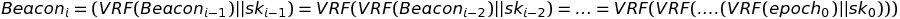
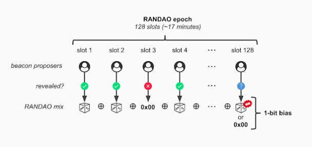
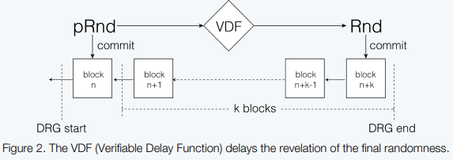
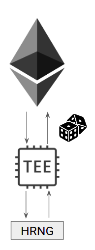

# Different choices for randomness

## The problem

One of the critical design goals of Witnet is the unpredictability of the committees that are in charge of resolving the data requests. In order to achieve such unpredicatability committees are selected at random for every data request based on a reputation score and a public beacon. A VRF function takes the data request ID and the public beacon and outputs pseudo-random number and a proof of correctness of the computation. The pseudo-random number is later divided by the hash length and compared to the reputation share that the node has to decide whether the node is eligible for computing the data request.

However, deciding how that such public beacon looks is a critical component for the system. Lets take for a moment the bitcoin example, in which the public beacon is composed by the hash of the previous block. If we utilized such a beacon, the previous miner could reorder transactions, or decide which transactions to include to affect the hash of the block and therefore, its potential eligibility for future data requests.

More specifically, in Witnet the elegibility of the committee is generated using a verifiable random function (VRF) having as inputs the blockHash of the last block and the epoch,
VRF(blockHash || epoch).

As before, the use of the blockHash incentivizes malicious actors to reorganize trnasactions in blocks so that the changes of being eligible increase.
Thus we need to study different mechanisms that can potentially mitigate these issues. In this document we review different approaches to improve upon this approach and prevent a miner from cleverly choosing the transactions inserted in a block to affect following eligibilities.

## Some solutions

#### 1. VRFs as randomness generators

One of the main issues with using the block hash as a beacon is that a miner can modify the resuting block hash to favor its odds in the next epoch. Therefore, one could think of utilizing something non-malleable by a miner as the input to the VRF, for instance, the epoch. The problem with this is that such an approach is predictable, and therefore the nodes would know for which epoch they would be eligible beforehand.

How can we improve upon this? Lets review what properties we need:
- Unpredictability
- Non-malleable

Those two properties are fullfilled by VRF outputs. Therefore why dont we utilize the VRF output of the previous epoch as a beacon for the current one? VRF outputs are already been transmitted between nodes to prove their eligibility. In this sense, the only thing that nodes would need to do is pin the VRF output into the block header. In short:

<em>Eq. 1: VRF output based beacon</em>

where _skj_ represents the secret key of the node that was elected in epoch _j_.

Such an scheme, assuming the participation of at least one honest participant in the scheme, would favor unpredictability (no one knows who is going to be eligible as VRF outputs will be different for different keys) and become non-malleable, as the output of the VRF is deterministic for a given input.

The obvious drawback from such an approach is that a block proposer can decide wether to:
- Propose the block and update the VRF based beacon.
- Withhold the block so that the previous VRF output is used as input.

This is usually called as the last revealer problem.

#### 2. Distribute the randomness over the last blocks

The idea is to make the beacon be composed of a single bit from each of the last 32 block hashes. This way the input of the VRF is composed of 32 bits from which a miner could influence at most one. Of course one thing that needs to be discussed in this option is what to use as input in the first 31 blocks of the chain.

#### 3. RANDAO
RANDAO is a DAO based Random Number Generator based on an economically incentivized commit-reveal scheme. It works as described in the following steps:

- Participants that wish to participate in the RANDAO protocol need to lock M eth in the contract.
- In the first phase, participants pick a random secret _s_ and publish _sha3(s)_
- If not enough commitments have been proposed, no random number is generated for that block
- If enough commitments are proposed, participants need to publish their secret.
- If all participants publish _s_ correctly, a function is applied over those values to get the random number
- If one participant fails to publish _s_, it is slashed, the locked money is distributed over those peers that published s and the random number is computed over the renamining values.
- If two or more participants fail to publish _s_, they are slashed, the slashed amount is distributed over the participants that published _s_ but no random number is computed at this block height.

<em>Fig. 1: VRF output based beacon</em>

As with the VRF based randomness, and despite the economic incentives placed, this sceme also falls from the last revealer problem. This is, the last party revealing the _s_ can decide not to reveal it thereby affecting the randomness.
 

#### 4. VDF + VRF

In order to avoid the problom described above, on solution that can be taken into account is the uses of Verifiable Delay Functions (VDF). This functions take a prescribed time to be computed, even in parallel computations. However, these functions can be easily verified.
This characterictic guarantees that no maliciuos actor can influence the output since the inputs will be finalized before the VDF. 

The classic example of this kind of function is finding the square root of _x_ modules _p_, which implies the computation of log(p) squaring while the verification implies only one simple square.

In our case, the use of these functions would be to use thema as a complementation of the VRF. More specifically, given the las block hash _H(B)_:

- A node _i_ compiles _ri = VRF(*si*|H(B)| epoch)_.
- With the _ri_ recieved in the network, an _R_ is computed, that will be the input of the VDF.
- The random value is calculated as _Rand = VDF(R)_. This would be the value compared by the nodes as it is done now in Witnet with the _VRF( blockHash| epoch)_.

The above contruction is just an idea of how could be integrated a VDF in the Witnet Network. (https://talk.harmony.one/t/unbiasable-randomness-generation-with-vrf-and-vdf/52)

On the other hand, the implemetation of this solutions has some drawbacks. First it is sometimes inconvinient to have such a delay for retrieveing inputs. Second, the functions usually are implemented in ASIC devices, increasing the cost.

<em>Fig2.: VRF+VDF approach</em>

This prevents someone to calculate the randomness beforehand and avoids last revealer. If the VDF takes more time to compute than the time to reveal the random number an attacker can not calculate the VDF output in time and make the decision upon it. This would serve to mitigate the VRF based randomness, e.g. setting up a VDF that takes more time than the block time. 

#### 5. SGX

One possibility to obtain a random Beacon is to ask a trusted hardware to generate it for us. Hardware Random Number Generators are able to obtain close to pure random numbers as they are based on physical sources like sensors that are good sources of entropy. Now, given that hardware can produce True Random Numbers, the next challenge is to provide guarantees that such a RNG has been used. That is indeed what Intel Software Guard Extensions are for.

IntelSGX provides cryptographic guarantees of the integrity of the code running inside its platform as well as the correctness of the output. This is offered thanks to the attestation and memory encryption properties. However, intelSGX has been demonstrated to be vulnerable to both side-channel and fault attacks. While the first offer little advantage to attackers when dealing with public beacons, the latter are considered a problem if the fault attack can induce predictable faults. In that scenario, an attacker hosting a public-beacon generator SGX instance could induce faults that benefit himself.

Furthermore, the economic incentives around these kind of scheme need to be well designed. SGX does not have network capabilities and thus needs to rely on the host OS to relay the information generated. If such information is public or retrieved through a side channel attack the host OS could deny relaying the beacon to the requested network. In those cases, we can expect the SGX instance hoster to have some economic penalties.

<em>Fig. 3: TEE based beacon</em>

## Discussion and Conclusion

For security reasons we decided to discard option 5, as we trully believe non-tamperable trusted hardware does not exists. We yet have not discovered the entire power of side channel and fault attacks against trusted hardware and therefore think TEEs are not yet prepared being used in a system like Witnet.

From the other options we also believe RANDAO involves at least 2 rounds of communication among a quite high number of peers (most likely the ARS in Witnet) and therefore we also consider it non-ideal.

Ooptions 1 and 2, without a VDF delaying the reveal of the actual random number offer the attacker only two possibilities. Perhaps from those Option 1 (VRF) seems more appropriate, as Option 2 would guarantee the attacking miner the block reward regardless of the block produced. In option 1 the attacking miner can decide to withhold the block but it would be renouncing to the block reward.

For the moment we consider that given the economic incentives in place not to renounce a block, adding a VDF would offer little advantage and involve high complexity. Therefore we decided to implement option 1, but we can re-consider adding the VDF approach on top if the economic reward is not enough to prevent malicious miners from withholding blocks.