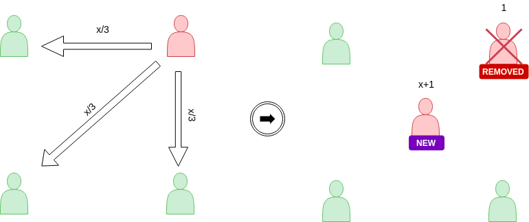
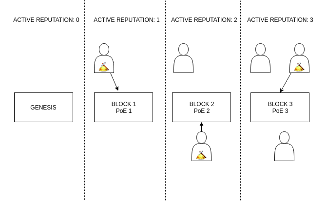
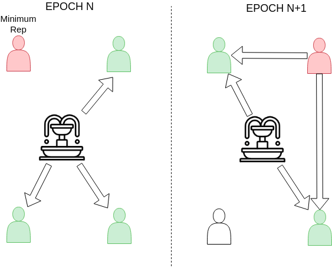

# Reputation Initialization in Witnet

## *How to kick-start a reputation system in a fair way*

Reputation systems let us characterize the trustworthiness of identities to perform a task. In the case of Decentralized Oracle Networks (DONs), reputation may be used to measure the capability and reliability of identities resolving data requests. In this scenario, a reputation based DON system can have two main functionalities, depending on whether the nodes are selected manually or automatically:

- Manual node selection, in which case the reputation is an informative value about the quality of the nodes that perform a job
- Automatic random node selection, in which case the reputation biases the odds that a node has to become eligible to perform a job

There is a significant difference between both. The former outsources the responsibility of selecting nodes, whereas the latter requires design patterns that ensure fairness while discouraging malicious acts. The following paragraphs describe how the eligibility is computed, how the reputation system game starts and the reasons behind some of the decisions we adopted in the case of Witnet.

## Reputation Based Eligibility

A DONs goal is to act as a tamper-resistant data feed. A reputation based DON should reward those nodes that have proven to behave correctly, i.e., to report precisely what is extracted from the requested data sources. In consequence, higher reputation needs to offer advantages to encourage good behavior. In the case of being selected to form a committee, the aforementioned advantage can come by just making the eligibility proportional to the reputation hold. In the case of Witnet, the eligibility is defined as follows:

<a href="https://www.codecogs.com/eqnedit.php?latex=H(<<t||rand(t)>>_{M_i})&space;\leq&space;I_i^t" target="_blank">>_{M_i})&space;\leq&space;I_i^t" title="H(<<t||rand(t)>>_{M_i}) \leq I_i^t" /></a>

Where *I_i* divides the reputation of peer *i* at time *t* over the total active reputation. Active reputation is a global objective metric that represents the active identities that have recently participated (in the form of pinned eligibilities) in the system. Note that the higher the influence of a node is, the higher the chances it will have to resolve data requests. The above equation, while intuitive, brings several questions to mind, such as the default reputation score or how peers start earning reputation. We reviewed the state of the art of reputation systems to check whether some insight ideas could help us answer the aforementioned questions.

__How do others kickstart their reputation systems?__

Reputation systems have been used for the last 20 years in many different use cases. Some of the most relevant domains in which reputation systems have been widely used are the following:

- **E-commerce**:. Online marketplaces have been using reputation systems in order to increase the quality of the offered services. For example, [eBay](http://wso2.com/download/wso2-ebay-case-study.pdf) is considered to have one of the most widely used reputation system, processing over a billion transactions per day.

- **Wireless Networks**. Many wireless networks, such as Mobile Ad-hoc Networks and Wireless Sensor Networks, use of [trust and reputation management systems](https://www.researchgate.net/profile/Zhiqi_Shen/publication/202356962_A_Survey_of_Trust_and_Reputation_Management_Systems_in_Wireless_Communications/links/53fee29e0cf23bb019be6a1d/A-Survey-of-Trust-and-Reputation-Management-Systems-in-Wireless-Communications.pdf) in order to provide additional means for protocol decision makings, thus improving the overall network’s quality of service.

- **Decentralized P2P Networks**. Some decentralized networks such as [Gnutella](https://www.cs.indiana.edu/~minaxi/pubs/reputation.pdf) and Kazaa have been clear examples where reputation systems may be used for the protocol to incentivize peers to behave honestly (e.g. by sharing resources).

Each reputation system, depending on their context and features, initializes their system differently. However, reputation systems in decentralized P2P networks are the most similar and relevant for blockchain-based systems as they aim to tackle similar challenges in terms of liveness and vulnerabilities to attacks such as flash or sybil attacks. 

The initialization of a reputation system could be simplified as the combination of two elements: how much reputation a newcomer receives and how the reputation is originated.

__Newcomers initial reputation__. Newcomers to reputation systems are considered critical. When they first join the system, they are unknown and thus, they can not be considered as bad reputed players. Non-careful design of the initial reputation score that newcomers obtain might lead to “re-entry attacks”, in which bad reputed users may take advantage of creating new identities in order to increase their reputation. This is also known as “**white washing**”. Most  reputation systems do not allow to accumulate negative reputation scores and set the initial default reputation as the minimum, so that white washing attacks are avoided. This has been widely be analyzed in the [literature](https://www.researchgate.net/profile/Ryan_Chard/publication/264983117_Reputation_systems_A_survey_and_taxonomy/links/5ba4ff2892851ca9ed1c5d7f/Reputation-systems-A-survey-and-taxonomy.pdf) and is the case of known reputation systems.

Initial reputation scores might also heavily impact the susceptibility to sybil attacks. In order to cope with them, some systems introduce a cost for the identity generation, either monetary or even in terms of investment in time or resources. For example, [Credence](https://www.usenix.org/event/nsdi06/tech/walsh/walsh.pdf) requires a heavy computation in order to grant a new identity and [NICE](http://www.cs.umd.edu/projects/nice/papers/Nice.Cookies.COMNET.pdf) grants some privileges to long-term identities. A perhaps more interesting approach takes into consideration the [majority behaviour](http://citeseerx.ist.psu.edu/viewdoc/download?doi=10.1.1.331.1214&rep=rep1&type=pdf) to adaptatively assign this initial reputation score to newcomers. For example, a metric that estimates the malliciousness of the system based on the amount of dishonest behaviours during a recent period of time.

__Reputation issuance__. Reputation is, by its nature, either declared (like fiat) or derived from visible indicators (like counting votes in an election). More concretely, if the reputation is declared, it could be already present in the system from the beginning or it could be progressively issued according to certain functions. If the reputation is derived, the indicators may be objective or subjective metrics visible by the system.

Most of existing reputation systems in decentralized P2P networks are based on visible indicators based on interactions between nodes (e.g. XRep, EigenTrust, R2Trust, GRAft). Thus reputation is not declared but derived from specific interactions over a period of time. In most systems, each node reputation score is computed based on the sum of those indicators.

## Game Initialization in Witnet

One of the core values of Witnet is to have low barriers to entry. In fact it would be ideal that a node is ready to participate as soon as an identity is created. How do we ensure that? From the reputation system examples provided and the eligibility equation, it is quite clear that newcomers need to have a default value that grants them with possibilities to become eligible. We call this the __default reputation__.

Perhaps the following question would be: what happens if someone behaves badly? Well, we envision DONs as networks in which a node can recover from misbehaving. In consequence, there should exist a minimum reputation that, once again, grants nodes with a (small) probability of becoming selected no matter how bad they behaved.

Note that the fact of having a minimum reputation implicitly means that there is a fixed amount of quantity that it is not redistributable. In the case of 256 bit identities, this non-redistributable amount of reputation points becomes *2²⁵⁶ · Rneutral*. For the sake of simplicity we can just assume *Rneutral* = 1. Since this is the non-redistributable reputation, how is the redistributable (and not necessarily tradeable) one distributed?
 
__Re-distributable Reputation__

A reputation system that penalizes for bad behavior needs the existence of a redistributable amount of reputation **_x · 2²⁵⁶_ that can be earnt or lost**. We identify two main options in which we can distribute these reputation points:

- **Equal node initialization**, in which every node starts with a number of reputation points above the neutral one, i.e., every node starts with x+1 reputation points.
 
- **Reputation issuance of  *x · 2²⁵⁶***, in which every node starts with neutral reputation, but  reputation points are periodically leaked over peers. This necessarily implies neutral and minimum reputations are identical.

<em>Fig. 1: Whitewashing happens when an identity that looses reputation benefits from opening a new identity.</em>

We observe a main issue with the first approach; it introduces **incentives to whitewash an identity**. Whitewashing (changing identity) occurs when an entity leaves the reputation system and then re-enters with a new identity in order to erase the poor reputation that was gathered with its previous identity. Obviously a node would rather choose to start a new identity if its reputation falls below *x+1* in the first case.

It looks thus that the reputation issuance option removes incentives for re-entering the game with new identities. Intuitively, **it also offers a better protection against sybil attacks**. The idea of having a higher amount of honest active reputation forces a sybil attacker to create more identities to increase his attack probability. Furthermore, as the reputation describes the behavior of a node resolving data requests the issuance should happen only __upon the existance of at least one data request__ resolution.  This issuance can be directed to:
- All existing nodes in the system
- All nodes that did not missbehaved in the system
- All nodes that behaved correctly in the system

It is obvious that the first two do not incentivize the honest participation on the resolution of a data request. In order to incentivize good behavior among peers, we choose the third option in which the __issuance is only distributed among honest peers__.

__Overall Initialization__

Now that we have established the basics of how reputation points are distributed, let’s describe what will happen in the genesis block. In the first epoch, there is no active reputation that has been presented to the network, and therefore, every peer will become eligible for mining. The luckiest one will mine the first block and pin its neutral reputation to the chain. In this manner, epochs will advance and **peers will start anchoring their reputation to the chain, thus growing the active reputation in the system**. Figure 3 is a clear example of how peers becoming part of the active reputation as they start becoming elected for performing tasks. Note that only in the genesis block the active reputation will be 0.

<em>Fig. 2: Active reputation starts growing as peers pin eligibility proofs in the chain.</em>

It is important to note that, while data requests are not present reputation points are not issued. This means that peers will all get to know each other with the neutral reputation until a data request is sent and honesty gets rewarded with reputation points. It also means that, once all peers have been discovered, they will all have the same chance of mining blocks.

Upon the insertion of a data request, honest peers will start earning reputation from two sides:

- Reputation issuance: that issues reputation towards those nodes that have participated honestly in the system
- Dishonest penalty: that transfer reputation from the dishonest (nodes outside consensus) to the honest (nodes that voted with the consensus).

Note that the latter might not be true if the dishonest has already the minimum reputation. Figure 3 represents two cases. In the first case, the dishonest node has minimum reputation and thus can not loose any more reputation, although it neither takes reputation points form the issuance. In the second case, the dishonest node has a reputation above the minimum, and thus it additionally suffers from the penalization.

<em>Fig. 3: Reputation transfer from dishonesty and issuance.</em>

## Conclusion

In this document we have given the basics of how the reputation system is initialized in Witnet. In particular we explained the problems that arise when a reputation system is initialized, leading us to make the following decisions:

- Witnet nodes will start with the default reputation that grants them with probability of being selected for a data request committee
- The minimum reputation will be identical to the default one. This avoids whitewashing attacks, while also ensures that nodes can recover from missbehavior
- The re-distributable amount of points will be issued periodically to peers that correctly resolve data requests
- Until data requests are inserted in the system, the influence of each node is calculated taking into account the default reputation of mining nodes

For more information please keep up to the documents posted in Witnet Research
