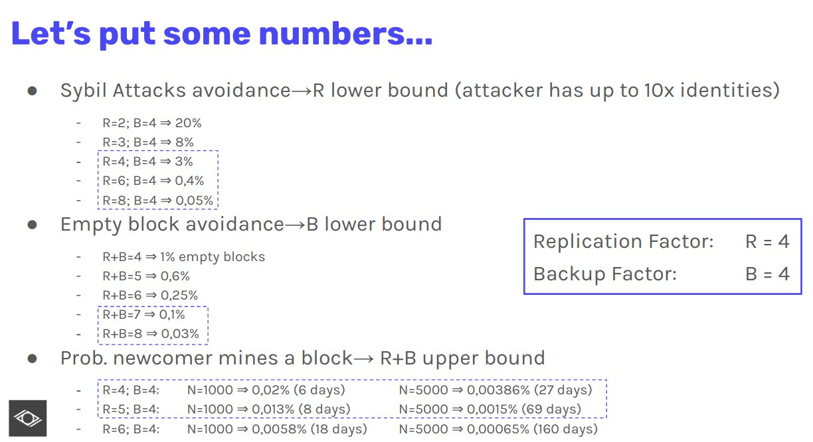

# RandPoE in Witnet

RandPoE (Random Proof of Eligibility) is the algorithm used to determine the node which will mine a block in Witnet. It is a sortition algorithm based on VRF (Verifiable Random Function) for which every node of the network has the same probability of mining a block:

Let's consider L defined as

```
L = (RF + BF) / N
```

Where RF = Replication Factor, BF = Backup Factor and N = Number of identities in ARS (Active Reputation Set), active nodes which have lately proved honest participation in resolving requests.

In Witnet a node is considered eligible when the hash of the VRF is lower than L

```
VRF_hash < L
```

The hash of the VRF is interpreted as a number between 0 and 1. When that number is lower than that probability the node is considered eligible.


## Randomness

The source of randomness used by the VRF is the beacon: the hash of the previous block and the current epoch number.

### Impact in the protocol
We need to ensure what are the implications of an attacker mining a block. We enumerate those as:
- Denial of Service

An attacker having the chance to mine can choose the transactions that are included in the block. They can choose to include no transactions, effectively slowing down the network.

No special countermeasure are needed, as the probability of mining consecutive blocks is very low.
[See DOS considerations](#dos-considerations)

- Selective mining

An attacker can choose the included transactions.

The commits of a data request can be used to control the "data request committee" and therefore influence the result of a data request.

The reveals of a data request can be censored but they cannot be forged.
For example, the result of a price feed cannot be outside of the ranges of the committed values.
But this can be used to attack certain identities, as failing to reveal after a commit results in a penalization.

The countermeasure for this is a number of additional reveal rounds configurable by the creator of a data request.
Based on the assumption that it is very improbable to mine many consecutive blocks.

- Forge Beacon

An attacker can control the source of randomness used by the VRF eligibility process.
It can influence their own probability of mining a block, or being eligible to commit to a data request
but they cannot negatively influence the probabilities of others, as the VRF is secret.

Countermeasures: it is proposed to modify the randomness source in a way that makes one miner only able to modify a few bits.

- Invalid blocks

An attacker cannot create invalid blocks because they will be rejected by the network.

- History rewrite

An attacker cannot rewrite the block history because the nodes will ignore old blocks, even if they are better than the consolidated blocks according to the consensus algorithm.
This attack can only work on nodes that are currently bootstrapping.

## DoS considerations
We have explained the implications that the mining eligibility might have in the protocol. One of the main concerns was the ability of an attacker to potentially affect the liveness of the protocol by continously creating empty blocks.

In order to analyze the odds for such an attacker to succeed, we are going to consider an attacker with unlimited number of nodes but all of them outside the ARS members (nodes with reputation > 1). We will consider the following two events to analyze this probability:

X: Number of ARS members eligible to mine a block. This event can be modeled as a binomial B(N, 1/N), where N is the number of identities in the ARS.

Y: Number of attackers nodes eligible to mine a block. This can be modeled as the binomial B(M, 1/N), where M is the number of attacker nodes and N is the number of identities in the ARS.

The attacker's probability to mine a block can then be calculated as

P(Attacker mines) = P(X=0 & Y>=1) =  P(X=0) * P(Y>=1)

As we do not want to limit the number of nodes an attacker holds, we can assume that P(Y>=1)=1. In that case, the attacker is only capped by the first term:

P(X=0) = ((N-1)/N)^N -> 1/e

The term converges to 1/e, which means an attacker would be able to propose a block with probability 1/e. This is quite a high number of odds for the attacker, so we can try to reduce by adding a replication factor RF.

In that case, the first term becomes:

P(X=0) = ((N-RF)/N)^N -> 1/(e^RF)

Some numbers with the replication

RF = 4 ~2%
RF = 5 ~0.6%
RF = 6 ~ 0.247%
RF = 7 ~ 0.09%
RF = 8 ~ 0.03%

Obviously for an attacker that wants to mine two blocks consecutively, the probabilities are squared.

With the replication factor we implicitely are reducing the number of epochs with empty blocks, which coincides with the 1/(e^RF) limit above explained. That means that in absence of an attacker, the aforementioned probabilities are also the probabilities of having no blocks in an epoch.

## NewComer considerations
But how does this affect a newcomer? The analysis is similar but this time we do not assume an infinite number of nodes hold by the newcomer. Essentially a newcomer would observe the same probability times a (R/N) of being eligible.

X: Number of ARS members eligible to mine a block. This event can be modeled as a binomial B(N, 1/N).

Y: The newcomer is eligible.


P(Newcomer mines) = P(X=0 & Y=1) = ((N-RF)/N)^N * (RF/N) = 1/(e^RF) * (RF/N)

Let's see an example.

The probabilities of mining for the newcomer are

|      | N=1000   | N=5000   |
|------|----------|----------|
| RF=4 | 0.0073%  | 0.00146% |
| RF=5 | 0.0033%  | 0.00067% |
| RF=6 | 0.00148% | 0.00003% |
| RF=7 | 0.00063% | 0.00001% |

As we can see, this number quickly becomes insignificant, making the chances of mining for the newcomer quite unfair.

## Back up factor as balancer

In order to give better chances to a newcomer (and by itself, to the attacker) without compromising the possibility of having empty blocks we can add the back up factor established before.

P(Attacker) = P(No eligibility in ARS with RF) + P(No eligibility in ARS with RF+1) +...+ P(No eligibility in ARS with RF+B)

P(empty block) = P(No eligibility in ARS with Backup RF+B) = (N-(RF+B)/N)^N

P(newcomer) = P(No eligibility in ARS with RF) * (RF/N) + P(No eligibility in ARS with RF+1) * ((RF+1)/N) + ... + P(No eligibility in ARS with RF+B)*((RF+B)/N)


Now, when multiple nodes can mine a block, the candidates are sorted according to their "VRF section":

```
VRF_hash < (RF + 0) / N
VRF_hash < (RF + 1) / N
VRF_hash < (RF + 2) / N
...
VRF_hash < (RF + BF) / N
```


When more than one node is eligible to mine a block, the candidate selection algorithm is:

- Choose the block in the smaller VRF section.
- In case of tie, choose the block whose proposer has more reputation.
- In case of tie, choose the block with the lower VRF hash.

This is done in order to prevent Sybil attacks: blocks mined by identities that actively participate in the protocol will always have priority.
