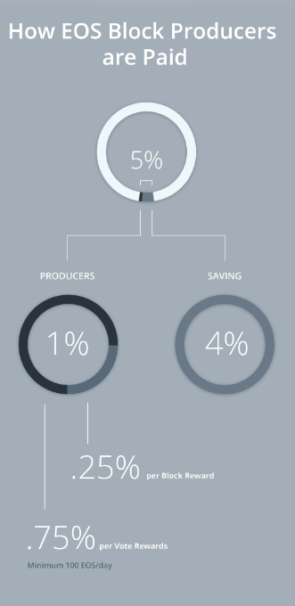

# The issuance of the Wit token
## Exploring different Wit token issuance cases
The Wit token plays a central role in the Witnet Decentralized Oracle Network. The Wit token plays a central role in the Witnet Decentralized Oracle Network:

- Secure data requests: Data requesters can specify an amount of tokens that witnesses need to stake in order to resolve the request. Furthermore, Witnet implements a coin age mechanisms that aims at hardening the coordinations of Sybil identities with available UTXOs. In this sense the Wit token plays a central role on securing data requests upon which big quantities depend.

-  Incentivize honest behavior: The Wit token is also envisioned as a reward for nodes that contribute to the network. It is thus expected that building blocks and validating transactions will be economically rewarded. Further, the Wit token will be the payment method for nodes fullfilling data requests succesfully (voting in consensus). 

- Community adoption: As the security of the Witnet network heavily depends on the decentralization level achieved, it is expected that the token will incentivize early adoption of the network.

- Sustainability: The Wit token should set the stage for a sustainable system whereby on equilibrium (stable demand), no scarcity nor surplus of tokens is generated.

# The Wit Token Supply and Demand
It is important that the supply and inflation of the Wit token adjusts well with the demand and security model of the Witnet network. As the demand for Witnet increases, the price of the Wit tokens increases, which means that Witnet can cover more use-cases in which higher bounties are at stake. This will also mean attackers must spend more to acquire sufficient collateralized Wit tokens and distribute them over their nodes. Furthermore, as demand increases, so too does the incentive to mine, again achieving a higher security degree on the network.
Once the demand meets an equilibrium point, the Wit token ideally should neither have a surplus nor suffer a scarcity problem. A surplus could encourage Witnesses to ask for more Wits per requests. Scarcity, achieved through e.g. burning processes, could raise the token value, and thus result in pricey data requests. In the following sections, we will discuss supply and inflation choices to discuss what benefits/drawbacks each of them could have on Witnet's model.

# Constant Reward Issuance
This option explores the possibility of issuing a constant reward to miners without having a hard cap. As per the following graph, this means that, while the supply increases linearly, the inflation rate per unit of time would decrease over time.

<em>Fig. 1: Supply and Inflation with constant reward issuance.</em>

We can therefore expect the token price to decrease at fixed rates in equilibrium, as demand is no longer increasing, while supply is. According to [the equation MV=PQ](https://www.investopedia.com/terms/m/monetaristtheory.asp), as more money enters circulation, we can expect that price (P) increases to equalize the equation. As a result, the data request price increases, and required collateral for the nodes increases. However, the incentives for honest nodes to hold those Wits reduces, allowing an attacker to acquire those Wits at a lower price.
From the miners point of view, fees would slowly increase over time, as the constant number of Wits received are valued at a lower price at equilibrium. This means fees would need to be regularly adjusted to compensate the loss of monetary power introduced by the inflation.
Dogecoin is an example of such emission curve.

<em>Fig. 2: EOS issuance.</em>

# Constant Inflation Rate
In contrast with the previous option, in this case we consider changing the reward per block every timeframe to achieve a constant inflation rate in a certain period of time. In this case, the supply growth per unit of time is not constant but rather is an increasing graph.

<em>Fig. 3: Supply and Inflation with constant inflation issuance.</em>

In some ways this option reflects the previous, although the depreciation of the token would happen significantly faster. There would be little incentive to join the network in the early stages, and no weighted advantage to being an early adopter. At equilibrium, collaterals would increase, posing uncertainties in both the price of the data requests and the collaterals that need to be specified.
With respect to the miner rewards, this issuance would maintain low fees as the mining reward increases every year.
Networks like EOS implement such an issuance which started with a 5% (from which 80% was allocated to Worker Proposal Fund) inflation rate per year but recently was reduced to 1%.

<em>Fig. 4: EOS issuance.</em>

 

# Decreasing Issuance
This is the curve that Bitcoin (among others) have implemented. In this case, the reward per block gets reduced every x units of time. This means the reward potentially reaches 0 (alongside the inflation). The supply converges to a fixed value dictated by both the time in which the reward gets reduced and the reward per se.

<em>Fig. 4: Supply and Inflation with decreasing issuance.</em>

This clearly incentivizes joining the network early on, due to the higher reward. This is key for a network like Witnet, in which we highly want a good number of witnesses to join from the start. Furthermore, at equilibrium (where demand does not increase) prices remain constant, as very little supply is being added per block. This favours predicability of the data request and collateral prices. This is crucial for Witnet, which can only secure data requests whose value is at most the value of the Witnet network. While token prices adjust with, for example, a constant inflation rate, attackers could take the opportunity to attack projects utilizing Witnet.
In this case, as reward for miners plummets, fees would need to compensate them to ensure they remain honest to the network. However, as very little monetary supply is introduced, we can expect fees to remain stable and constant at the equilibrium point. An identical situation would be observed with collaterals; as the price of the data requests remains constant, the data requests do not need to update the corresponding collaterals.

# Parametric based on collaterals/requests
Another option would be to make inflation parametric based on the number of requests observed in a certain unit of time or the collateralized amount in the same unit of time. Although this would be ideal, we find that this can be gameable in ways we cannot predict. For instance, one could ask to perform a data request whose collateralization is high in order to take advantage of newly minted Wits to play with the price. 
On the other hand, miners could decide not to include transactions related to data requests/collateralization so that the miner reward stays high as much time as possible. Thus, this kind of inflation gives miners quite a lot of incentive to censor transactions, and reduce the level of decentralization (no single entity with enough power to censor/power) in the network.

# Issuance Combinations
Some projects have decided to implement a mix of the aforementioned schemes. One of the examples is Monero, which has a decreasing issuance supply type until the end of May, 2022. Thereafter, Monero will utilize a constant reward issuance, with a 0.6 XMR constant reward for every 2-minute block, and achieve a <1% inflation (decreasing over time). The main reasoning behind this tail emission is to avoid one of the main critics of the Bitcoin supply: the only-fee scenario.

<em>Fig. 5: Monero inflation and supply vs Bitcoin.</em>

This could be interesting for the Wit token. Nobody knows how a only-fee market will behave, but theoretically this could break our assumption of block producers in the event of ties being those with higher reward. Essentially nodes will prefer to mine on those blocks that include less transactions, e.g., those with lesser fees.

# Conclusions
We reviewed different type of issuances for the Wit token, with their corresponding pros/cons. There seems to be a clear call to adopt a decreasing issuance in order to favour early adoption of the network while still maintaining data request price stability on equilibrium. The impredictability of what would happen on an only-fee blockchain makes us question whether to adopt a Monero-like issuance or stay with the classic Bitcoin-like issuance.

# Potential halving acceleration/deceleration
Here lets assume that our curve follows the decreasing issuance model, either combining it with some other model once the issuance has finished or by itself. There are several values we can based on, but we decided to maintain constant the total supply. Based on that, we can specify different values for rewards and halving that converge in:

<em>Eq 1: Total supply equation</em>

We have [here](https://github.com/girazoki/tokenomics) scripts that automatically generate values for a given Initial Supply and Total Supply. The following graphs have been generated assuming 2,500,000,000 of total supply and an initial supply of 750,000,000. Here we assume we have a base InitialReward=500 and HalvingPeriod=1,750,000, which we will multiply/divide respectively by a multiplier.

<em>Fig. 5:   Vesting, inflation and supply with constant inflation issuance.</em>

Overall we observe that the inflation is similar around 5 years so we choose to stay with the multiplier 1 to ensure the inflation is not too high over the first years.